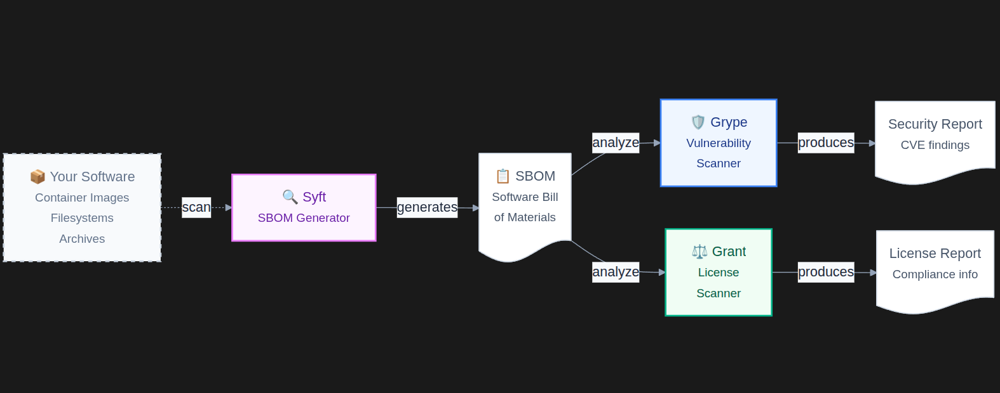

# Workflow - Anchore

## Introduction

The Anchore workflow combines multiple tools into a single scanning pipeline:

- [Syft](/en/v1.1.0/syft) — generates an SBOM of the target.
- [Grype](/en/v1.1.0/grype) — scans that SBOM for known vulnerabilities.
- [Grant](/en/v1.1.0/grant) — scans that SBOM for license compliance issues.

Using this workflow (built on the [Anchore](https://anchore.com/) toolset), a system, container, or project can be scanned to provide:

- **Dependency analysis** — via Syft and Grype.
- **License analysis** — via Grant.

The current implementation runs a **system-wide scan only**, triggered on a schedule via cron.

## Implementation

This workflow performs the following steps:

1. Installs and configures Syft, Grype, and Grant on the specified host, using a shared `anchore` user, group, configuration folder, and log folder for all three tools.
2. Syft and Grype are installed **without** their own scheduled cron job (`syft_time` and `grype_time` are left empty).
3. Grant is scheduled (by default, every Sunday at 3 AM) to run a combined job that:
   - Generates a fresh SBOM of the host with Syft.
   - Scans that SBOM for vulnerabilities with Grype.
   - Checks that SBOM for license compliance issues with Grant.
4. Output from each step is appended to the shared log folder (`/var/log/anchore` by default).

## Workflow organization



## Ansible workflow usage

```yaml
- name: Installs the Anchore workflow
  hosts: vagrant-ubuntu-1
  become: true
  roles:
    - syft
    - grype
    - grant
  vars:
    group: anchore
    user: anchore
    config_folder: /etc/anchore
    log_folder: /var/log/anchore

    syft_group: "{{ group }}"
    syft_user: "{{ user }}"
    syft_time: {} # No cron job for Syft; it only runs as part of Grant's scheduled job
    syft_config_folder: "{{ config_folder }}"
    syft_log_folder: "{{ log_folder }}"

    grype_group: "{{ group }}"
    grype_user: "{{ user }}"
    grype_time: {} # No cron job for Grype; it only runs as part of Grant's scheduled job
    grype_config_folder: "{{ config_folder }}"
    grype_log_folder: "{{ log_folder }}"

    grant_group: "{{ group }}"
    grant_user: "{{ user }}"
    grant_time:
      weekday: "0"
      hour: "3"
      minute: "0"
    grant_config_folder: "{{ config_folder }}"
    grant_log_folder: "{{ log_folder }}"
    grant_job_title: "Anchore workflow - EasySec"
    grant_job: > # Chains Syft, Grype, and Grant into a single scheduled job
      {{ syft_binary_path }} -c {{ syft_custom_config_path }} / -o json > {{ syft_log_folder }}/audit-sbom.json 2>&1 &&
      {{ grype_binary_path }} -c {{ grype_custom_config_path }} sbom:{{ syft_log_folder }}/audit-sbom.json >> {{ grype_log_path }} 2>&1 &&
      {{ grant_binary_path }} -c {{ grant_custom_config_path }} check {{ syft_log_folder }}/audit-sbom.json >> {{ grant_log_path }} 2>&1
```

### Properties

- `group` (string, optional): Shared group used to run Syft, Grype, and Grant, and to access their reports/logs. Default: `anchore`.
- `user` (string, optional): Shared user used to run Syft, Grype, and Grant, and to access their reports/logs. Default: `anchore`.
- `config_folder` (string, optional): Shared configuration folder used by all three tools. Default: `/etc/anchore`.
- `log_folder` (string, optional): Shared log folder used by all three tools. Default: `/var/log/anchore`.

The per-tool variables (`syft_*`, `grype_*`, `grant_*`) map to the properties documented on the individual [Syft](/en/v1.1.0/syft), [Grype](/en/v1.1.0/grype), and [Grant](/en/v1.1.0/grant) pages. In this workflow, only Grant is scheduled — its job runs Syft, Grype, and Grant in sequence, so a single cron entry produces a full SBOM, vulnerability, and license scan.

## When to include this workflow

- **At the system level**: possible, but not particularly recommended — more system-specific tools, such as Lynis, are generally a better fit for that use case.
- **In CI/CD pipelines** (Jenkins, Bitbucket, GitHub, etc.): this is where the workflow is most useful, since it can scan project dependencies and container images as part of the build process.
